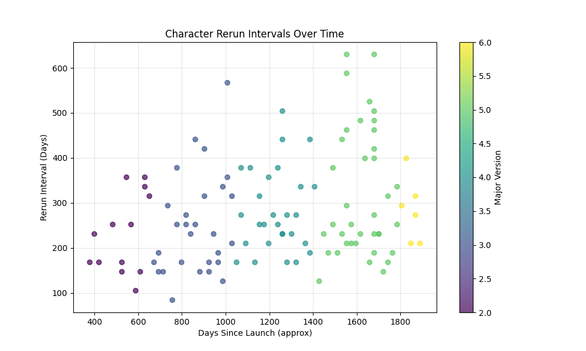
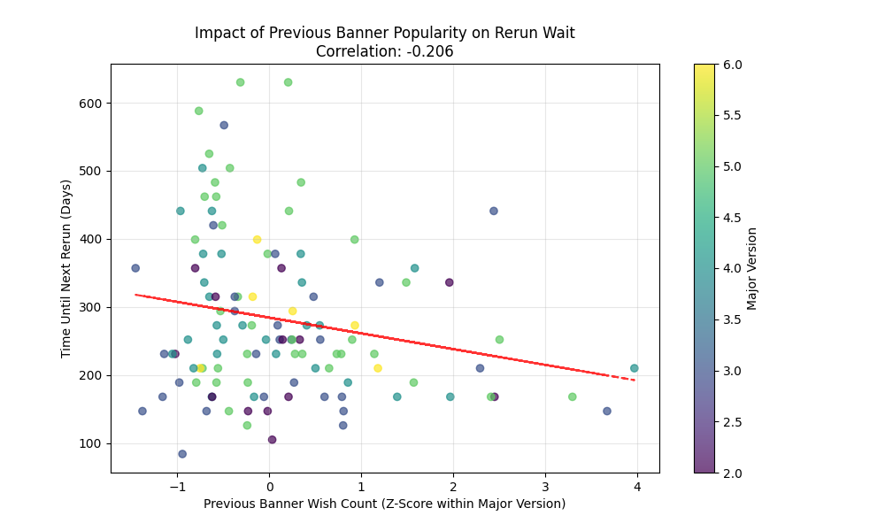
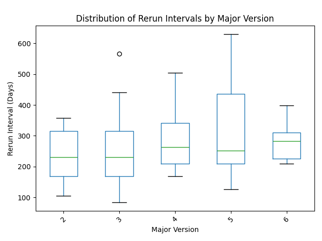

# Genshin Impact Rerun Interval Analysis Report

## 1. Introduction
This project explores the relationship between character rerun intervals and their banner popularity (wish counts) in *Genshin Impact*. The rerun interval—the time between a character’s consecutive banner appearances—is a critical factor for players planning their resource allocation. This analysis utilizes data from *paimon.moe* (aggregated in `wish_stats.txt`) to investigate whether popular characters tend to return sooner.

## 2. Methodology
### Data Processing
- **Source**: `wish_stats.txt` (Banner history from Version 1.3 to 6.2).
- **Date Estimation**: Timeline was reconstructed by assigning 42 days per version.
    - Versions 1.0-1.2 were missing from the dataset; analysis begins from Version 1.3.
- **Rerun Interval**: Calculated as the number of days between the start of the current banner and the start of the previous banner (minus ~21 days for banner duration).
- **Popularity Normalization**: To account for the fluctuating player base size across years, "Wish Counts" were improved by calculating a **Z-Score** within each Major Version (1.x, 2.x, etc.). This allows for a fair comparison of a character's relative popularity against their contemporaries.

### Metrics
- **Rerun Interval (Days)**: Time gap between appearances.
- **Previous Banner Popularity**: The relative wish count (Z-score) of the character's *immediately preceding* banner, used to predict the wait time for the current rerun.

## 3. Findings

### 3.1 Evolution of Rerun Intervals
There is a general upward trend in rerun intervals as the character roster expands.

**Average Rerun Interval by Major Version:**
- **2.x**: 231 Days
- **3.x**: 249 Days
- **4.x**: 282 Days
- **5.x**: 320 Days
- **6.x**: 283 Days (Partial data)

The expanding roster creates a "bottleneck," forcing players to wait longer for reruns on average, despite the introduction of double/triple banners (implied by the data structure with multiple phases).

### 3.2 Popularity vs. Rerun Timing
We hypothesized that characters with higher wish counts (more revenue potential) would be prioritized for reruns (shorter intervals).

- **Correlation Coefficient**: **-0.206**
- **Interpretation**: There is a weak negative correlation. This implies a slight tendency for popular characters to rerun sooner (negative slope), but the relationship is not strong. Other factors (story relevance, new skin releases, synergistic new characters) likely play a more dominant role in scheduling than raw sales figures alone.

### 3.3 Distribution of Wait Times
The variance in wait times has also increased over time.

While the median wait time has increased, the spread (interquartile range) in recent versions indicates less predictability. Some characters return very quickly (likely due to story events), while others suffer from extended "benched" periods.

## 4. Conclusion
The analysis confirms that while popularity has a minor influence on rerun scheduling (popular characters wait slightly less), the primary driver of rerun interval growth is simply the increasing size of the character pool. The slight negative correlation (-0.21) suggests that HoYoverse balances revenue optimization with other game health factors, preventing a fully "popularity-driven" schedule.

Players should expect average wait times to continue trending upwards of 9-10 months (approx 280-320 days) unless the banner capacity is further expanded.
